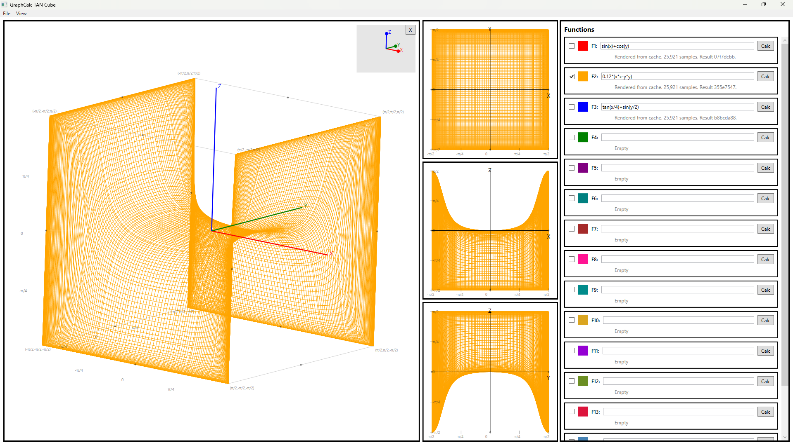

# ♾️ Infinity Cube Graphing Calculator

[](https://dotnet.microsoft.com/)
[](https://www.microsoft.com/windows)
[]()
[]()
[]()

A native Windows desktop graphing calculator for visualizing functions inside a finite **Infinity Cube**.

Infinity Cube uses **arctangent compactification** to map infinite real X, Y, and Z values into a finite rotatable cube. This makes infinity visible as a bounded geometric object.



---

## 🤖 AI Agent & Developer Summary

- **Frontend / UI:** WPF native Windows desktop application
- **Internal API:** Local GraphCalc API process
- **Backend / Math Engine:** Expression evaluation, deterministic sampling, result caching
- **Storage:** SQLite-backed result metadata and cache support
- **Core Visualization:** Compactified 3D function rendering inside an Infinity Cube
- **Render Modes:**
  - Mesh mode for technical inspection
  - Surface mode for cinematic lit surfaces
  - Surface Quality: Fast, Smooth, Cinematic
- **Sampling Model:** Boundary-weighted TAN projection sampler
- **Target Platform:** Windows 11 desktop
- **Project Baseline:** R12

---

## 🚀 What Is the Infinity Cube?

Traditional graphing calculators show finite windows into infinite mathematical spaces. Infinity Cube takes a different approach.

It maps real values into finite angular coordinates:

```text
θx = atan(x)
θy = atan(y)
θz = atan(z)
```

So the entire infinite real axis maps into:

```text
-π/2 < θ < π/2
```

That creates a finite cube where X, Y, and Z all approach infinity at the cube boundary.

The user-facing name is:

```text
Infinity Cube
```

The technical model is:

```text
Arctangent compactification
```

---

## 🧠 Coordinate Model

The app samples visible TAN-projected angular coordinates, then converts those samples back into real values for function evaluation.

For each sample:

```text
θx and θy are selected inside (-π/2, π/2)

x = tan(θx)
y = tan(θy)

z = f(x, y)

θz = atan(z)
```

The rendered point is:

```text
(θx, θy, θz)
```

This means:

- X, Y, and Z are treated consistently.
- The cube has fixed bounds.
- No function is allowed to autoscale the world.
- Turning functions on/off does not resize the graph.
- The visible cube always represents compactified infinity.

---

## 🧭 Visual Design Rule

For ordinary real-space shapes, use:

```text
x*x + y*y
```

For shapes that should look controlled inside the Infinity Cube, use projected radius:

```text
atan(x)*atan(x) + atan(y)*atan(y)
```

This is one of the main design discoveries in the project.

Real-space radius can produce shapes that look too wide, too flat, or too strange after compactification. Projected radius lets you design the visible shape directly.

---

## 🧮 Sample Function Library

Paste these directly into the function input rows.

### Basic oscillatory surface

```text
sin(x)+cos(y)
```

Good for testing bounded oscillatory behavior. It remains bounded in Z but oscillates forever toward the edges.

### Directional saddle

```text
0.12*(x*x-y*y)
```

Good for testing directional divergence. Z approaches positive or negative infinity depending on direction.

### Tangent mixed wave

```text
tan(x/4)+sin(y/2)
```

Good for testing strong boundary behavior and tangent growth.

### Positive Z horn

```text
1/(0.00000001 + sqrt(x*x + y*y))
```

A simple real-space radial horn. It creates a sharp central rise but can become wide in the compactified view.

### Projected radial squiggle / spacetime ripple

```text
(2.4*exp(-1.8*sqrt(atan(x)*atan(x)+atan(y)*atan(y)))*sin(12*sqrt(atan(x)*atan(x)+atan(y)*atan(y)) + 9*(atan(x)*atan(x)+atan(y)*atan(y))))/(0.03 + sqrt(atan(x)*atan(x)+atan(y)*atan(y)))
```

This creates a radially symmetric oscillating ripple using projected radius.

### Cosmic horn / expansion funnel

```text
-(1/(0.000000001 + 0.35*sqrt(atan(x)*atan(x)+atan(y)*atan(y)) + 4*(atan(x)*atan(x)+atan(y)*atan(y)) + 180*(atan(x)*atan(x)+atan(y)*atan(y))*(atan(x)*atan(x)+atan(y)*atan(y))))
```

A continuous projected-radius horn. It creates a sharp inward funnel-like shape with a gradual body.

### Positive version of the cosmic horn

```text
1/(0.000000001 + 0.35*sqrt(atan(x)*atan(x)+atan(y)*atan(y)) + 4*(atan(x)*atan(x)+atan(y)*atan(y)) + 180*(atan(x)*atan(x)+atan(y)*atan(y))*(atan(x)*atan(x)+atan(y)*atan(y)))
```

### Smooth bounded surface

```text
atan(x)+atan(y)
```

Good for testing cached-result rendering and duplicate-expression behavior.

### Singularity test

```text
1/(x-y)
```

Useful for testing discontinuity handling.

### Product oscillation

```text
sin(x*y)
```

Useful for testing dense oscillation and boundary sampling.

---

## 🖥️ Features

### 3D Infinity Cube

The main left panel renders the compactified 3D function view.

It includes:

- fixed X/Y/Z compactified bounds
- rotatable cube camera
- quaternion / virtual-trackball style rotation
- gimbal visualizer
- X axis in red
- Y axis in green
- Z axis in blue
- peripheral π labels and cube landmarking

### Projection Panels

The three middle panels show synchronized projections:

```text
XY
XZ
YZ
```

These use the same sampled result as the 3D view.

They help diagnose:

- X/Y sampling behavior
- Z boundary behavior
- oscillations
- discontinuities
- function symmetry
- edge behavior near compactified infinity

### Fifteen Function Inputs

The right panel contains function rows:

```text
F1 through F15
```

Each row supports:

- visibility checkbox
- color swatch
- expression input
- Calc button
- per-function status

Function visibility is independent. Duplicate expressions are allowed and render correctly per function row.

---

## 🎨 Render Modes

### Mesh Mode

Mesh mode is the technical inspection view.

Use it for:

- checking sampling
- seeing wire structure
- reviewing edge behavior
- debugging discontinuities
- comparing function geometry

### Surface Mode

Surface mode is the cinematic view.

Use it for:

- presentation-quality rendering
- smooth surfaces
- lit materials
- function shape exploration

Surface mode includes:

- filled surfaces
- cinematic material lighting
- cleaner projection panels
- quality settings
- backface and boundary artifact protections

### Surface Quality

Available from the View menu:

```text
View > Surface Quality > Fast
View > Surface Quality > Smooth
View > Surface Quality > Cinematic
```

Suggested use:

- **Fast** for quick previews
- **Smooth** for regular surface use
- **Cinematic** for best visual quality

---

## ⚙️ Level of Detail

Available from:

```text
File > Level of Detail...
```

LOD changes the deterministic sample count and edge reach.

The R8+ sampler intentionally places more detail near the edge of the Infinity Cube, where infinity lives.

Typical profiles:

```text
Draft
Standard
High
Ultra
Insane
```

Heavy modes may be gated behind:

```text
Allow heavy LOD modes
```

---

## 🧪 Test Mode

Available from:

```text
File > Test Mode...
```

Test Mode contains diagnostics that should not clutter the main UI.

It includes:

- API health check
- log folder access
- sampler readout
- render mode diagnostics
- triangle statistics
- cache/render status
- optional triangle edge overlay

Logs are intended to support iterative troubleshooting.

---

## 🧱 Project Structure

```text
Graphing Calculator R12/
├── .git/
├── Images/
├── Requirements/
├── scripts/
├── src/
│   ├── GraphCalc.Api/
│   ├── GraphCalc.Shared/
│   └── GraphCalc.UI/
├── Testing/
├── .gitignore
├── GraphCalcStarter.sln
├── LICENSE
└── README.md
```

---

## 🔁 Calculation Flow

```text
User enters expression
User clicks Calc or LOD changes
UI sends calculation request to API
API checks cache
If cache hit, API returns result metadata and samples
If cache miss, API evaluates function over deterministic sampler
UI builds render geometry from result
Mesh or Surface renderer displays the function
```

Render mode switching should not recalculate samples.

Only these should recalculate:

```text
expression changes
LOD changes
cache is missing
sampler version changes
calculation is explicitly requested
```

---

## 🛠️ Setup Instructions

### 1. Prerequisites

Install:

- Windows 11
- .NET SDK 8 or later
- Git
- Optional: Visual Studio 2022
- Optional: GitHub Desktop

Check .NET:

```cmd
dotnet --version
```

Check Git:

```cmd
git --version
```

### 2. Build

Open Command Prompt:

```cmd
cd /d "E:\Graphing Calculator R12"
scripts\01_check_prereqs.cmd
scripts\02_restore.cmd
scripts\03_build.cmd
```

Expected result:

```text
Build succeeded
```

### 3. Run

Use two Command Prompt windows.

API window:

```cmd
cd /d "E:\Graphing Calculator R12"
scripts\04_run_api.cmd
```

UI window:

```cmd
cd /d "E:\Graphing Calculator R12"
scripts\05_run_ui.cmd
```

Leave the API window open while using the UI.

---

## 🧑‍💻 Useful Code Concepts

### Coordinate compactification

```csharp
double thetaX = Math.Atan(x);
double thetaY = Math.Atan(y);
double thetaZ = Math.Atan(z);
```

### Recovering real-space values from display samples

```csharp
double x = Math.Tan(thetaX);
double y = Math.Tan(thetaY);
```

### Render point

```csharp
var point = new Point3D(thetaX, thetaY, thetaZ);
```

### Projected radius

```csharp
double ax = Math.Atan(x);
double ay = Math.Atan(y);
double q = ax * ax + ay * ay;
```

### Projected radial distance

```csharp
double r = Math.Sqrt(
    Math.Atan(x) * Math.Atan(x) +
    Math.Atan(y) * Math.Atan(y)
);
```

---

## 🧾 Git Setup

Recommended `.gitignore` should exclude:

```text
bin/
obj/
.vs/
logs/
data/
cache/
*.db
*.sqlite
*.log
```

Commit from the project root:

```cmd
cd /d "E:\Graphing Calculator R12"
git status
git add .
git commit -m "Initial Infinity Cube Graphing Calculator project"
git push -u origin main
```

If GitHub asks for a password, use a GitHub personal access token instead of your account password.

---

## 🧭 Design Lessons Learned

### Infinity needs edge-heavy sampling

A center-heavy sampler did not feel like infinity.

The R8 BoundaryWeightedTanSampler became the visual baseline because it places more detail near:

```text
θ = ±π/2
```

That is where infinity lives in the compactified view.

### Real-space shape intuition does not always survive compactification

A formula that looks skinny in real space can look wide in the Infinity Cube.

For visible design, use:

```text
atan(x)
atan(y)
```

instead of only:

```text
x
y
```

### Mesh and Surface serve different purposes

Mesh mode is for inspection.

Surface mode is for visual quality.

Both are needed.

### Diagnostics belong in Test Mode

The main UI should stay graph-focused.

API status, log paths, render diagnostics, triangle counts, and sampler details belong in:

```text
File > Test Mode...
```

---

## 🧭 Suggested Future Work

### Direct3D Renderer

The current WPF renderer has been pushed far.

A future Direct3D renderer could use:

- GPU buffers
- hardware z-buffer
- shader-based lighting
- better transparency
- instanced line rendering
- smoother surface normals
- improved multi-function rendering

### Function Library

Add a built-in preset library:

- Oscillation
- Saddle
- Horn
- Ripple
- Funnel
- Singularity
- Compactified demos

### Export

Add:

- screenshot export
- function preset export
- session save/load
- render settings export

### Better Formula Editing

Add:

- syntax validation
- autocomplete for functions
- formula history
- named constants
- quick duplicate function row

---

## 📌 Project Status

Current conceptual baseline:

```text
R8 BoundaryWeightedTanSampler
R11 cinematic Surface baseline
R12 Surface boundary artifact fixes
```

Current product identity:

```text
Infinity Cube Graphing Calculator
```

Technical identity:

```text
Arctangent-compactified 3D function viewer
```

Core idea:

```text
Make infinity visible as a finite geometric object.
```
